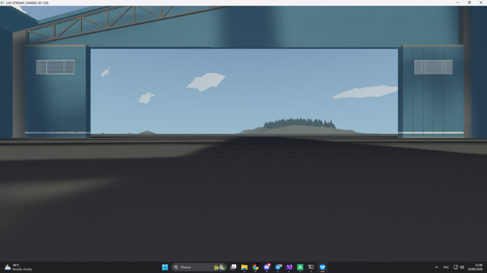
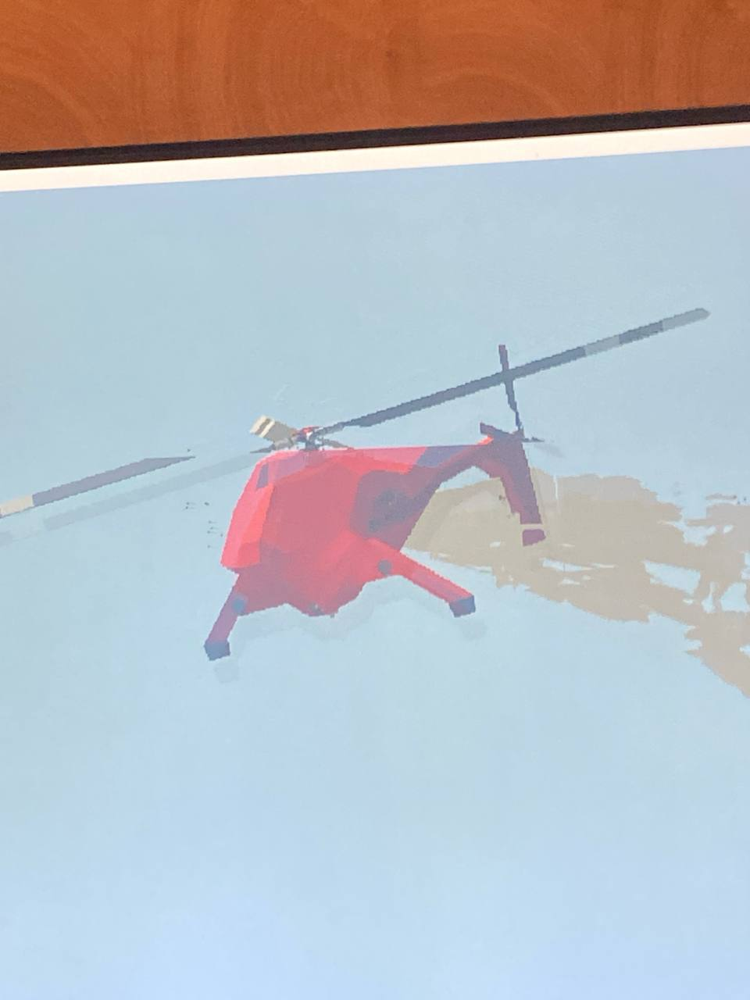
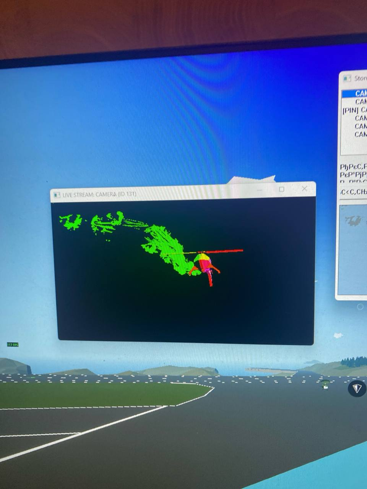
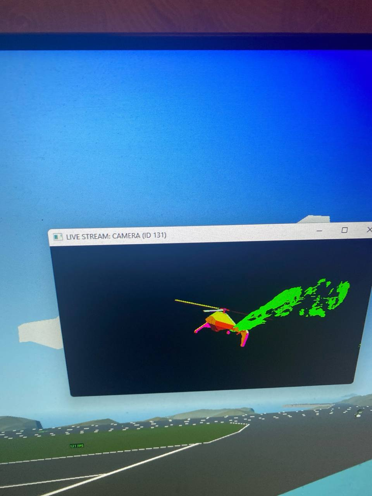

# Stormworks Camera Extractor (Мод для вывода камер в отдельное окно)

Язык / Language: [English 🇬🇧](README.md) | **Русский 🇷🇺**

---

Модификация для игры **Stormworks: Build and Rescue**, которая перехватывает текстуры игровых мониторов и выводит изображение с камер в отдельное полноценное окно Windows. Это позволяет легко перенести камеры или дисплеи вашей техники на второй монитор.

---

## 🍕 Поддержать проект / Мне очень нужны деньги на еду

Разработка и реверс-инжиниринг игрового кода требуют огромного количества времени, сил и бессонных ночей. Если эта утилита помогла вам или спасла вашу систему с несколькими мониторами, **мне очень нужна ваша поддержка, чтобы продолжать работу и банально покупать еду!** Любое пожертвование невероятно ценно.

| **ETH (Ethereum / ERC-20)** | **USDT (ERC-20)** | **TRX (Tron Network)** |
| :---: | :---: | :---: |
| `0xC280Eb895795B1058C8A671eD79aDBFe14c7F71C` | `0xC280Eb895795B1058C8A671eD79aDBFe14c7F71C` | `TU27CurhG86YXTVyeYPWqZYLd9NMfAMWAD` |
|  |  |  |

---

## 📸 Гайд и Скриншоты

### Шаг 1. Настройка проекта в Visual Studio
Для компиляции проекта необходимо создать проект `Dynamic-Link Library (DLL)` в Visual Studio. В свойствах проекта (`Configuration Properties -> VC++ Directories`) обязательно укажите пути к заголовочным файлам (Include) и библиотекам (Library) для **MinHook** и **Kiero**.

### Шаг 2. Инициализация графического хука (OpenGL)
В коде инициализируется библиотека Kiero под OpenGL, а MinHook подменяет оригинальную функцию `wglSwapBuffers`. Это позволяет программе перехватывать буфер кадра до того, как он отрисуется на основном экране.

### Шаг 3. Внедрение (Инжекция) DLL в игру
Поскольку утилита компилируется в формат `.dll`, её необходимо внедрить в процесс запущенной игры `stormworks.exe`. Для этого можно использовать любой стандартный DLL Инжектор (например, Process Hacker, Cheat Engine или собственный кастомный лаунчер).

### Шаг 4. Финальный результат
После успешной инжекции игра продолжает работать стабильно и без потери производительности, при этом на рабочем столе появляется новое независимое окно, полностью дублирующее поток выбранной камеры.

---

## 🛠 Требования для компиляции

Чтобы успешно собрать данный проект из исходного кода, вам понадобятся следующие зависимости:

1. **Kiero Hook (v2)** — Универсальный инструмент для поиска адресов функций графических API. Он необходим для нахождения указателя на функцию графического контекста OpenGL в игре Stormworks.
   
2. **MinHook** — Минималистичная библиотека на C для создания хуков (detours) в x86/x64 системах. Она перенаправляет вызов оригинальной функции отрисовки игры на вашу кастомную реализацию.

3. **OpenGL (Заголовочные файлы и расширения)** — Так как Stormworks построена на OpenGL, вам понадобятся заголовочные файлы расширений (например, **GLEW** или **glad**) для работы с буферами кадров (Framebuffers) и текстурами камер, а также линковка с `Opengl32.lib`.

---

## 🍕 Поддержать проект / Купите мне немного еды

Разработка и реверс-инжиниринг игрового кода требуют огромного количества времени, сил и бессонных ночей. Если эта утилита помогла вам или спасла вашу систему с несколькими мониторами, **мне очень нужна ваша поддержка, чтобы продолжать работу и банально покупать еду!** Любое пожертвование невероятно ценно.

| **ETH (Ethereum / ERC-20)** | **USDT (ERC-20)** | **TRX (Tron Network)** |
| :---: | :---: | :---: |
| `0xC280Eb895795B1058C8A671eD79aDBFe14c7F71C` | `0xC280Eb895795B1058C8A671eD79aDBFe14c7F71C` | `TU27CurhG86YXTVyeYPWqZYLd9NMfAMWAD` |
|  |  |  |

*Спасибо за поддержку независимой разработки!*

---

## 📝 Примечание касательно языка
*Эта документация проекта и локализованные тексты были созданы с помощью ИИ-ассистента, так как я не говорю и не пишу свободно по-русски.*